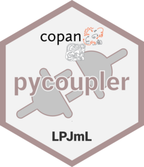

# pycoupler: dynamic model coupling of LPJmL <a href=''></a>

[](https://doi.org/10.5281/zenodo.11576705) 
[](https://github.com/PIK-LPJmL/pycoupler/actions) [](https://codecov.io/gh/pik-lpjml/pycoupler)
[](https://badge.fury.io/py/pycoupler)

An LPJmL-Python interface for operating [LPJmL](https://github.com/PIK-LPJmL) in
a Python environment and coupling it with Python models, programmes or simple
programming scripts.
*pycoupler* was written to establish a coupled World-Earth
modeling framework, [copan:LPJmL](https://github.com/pik-copan/pycopanlpjml),
based on [copan:CORE](https://github.com/pik-copan/pycopancore/) and LPJmL.
Coupling with LPJmL is possible on an annual basis, i.e. for each year in which
LPJmL is in coupling mode, the desired inputs must be passed via
*pycoupler*.
LPJmL simulates the corresponding year and returns the desired outputs at the
end of the year.
The coupled programme can use the output data to generate new inputs for the
next year.

## Overview

### LPJmL Config &#9881; for handling LPJmL configurations
* Read & write &#9997; LPJmL configuration files as `LPJmLConfig` objects
* Set options & parameters for spinup, transient and coupled simulations
* `regrid()` &#127760; LPJmL output data for country-specific simulations
* LPJmL can be checked `check_lpjml()` &#128269; and operated `run_lpjml()` &#9654; `submit_lpjml()` &#128640; with written configuration files

### LPJmL Coupler &#128268; to couple LPJmL with other models
* `LPJmLCoupler` class to initiate bi-directional, annual coupling to LPJmL
* &#128229; Read output data (annual) from LPJmL
* &#128228; Send input data (annual) to LPJmL

### LPJmL Data &#128190; for reading and processing LPJmL data
* [xarray](https://github.com/pydata/xarray)-based data classes
* Read LPJmL netCDF files &#128506; as `LPJmLData` or `LPJmLDataSet`objects
* `LPJmLMetaData` for reading and handling LPJmL meta files or header data

## Installation

```bash
pip install pycoupler
```

### Prerequisites
Please clone and compile [LPJmL](https://github.com/PIK-LPJmL/LPJmL) in advance.  
Make sure to also have set the [working environment for LPJmL](https://github.com/PIK-LPJmL/LPJmL/blob/master/INSTALL) correctly if you are not working
on the PIK HPC (with Slurm Workload Manager).  

## Questions / Problems

In case of questions please contact Jannes Breier jannesbr@pik-potsdam.de or [open an issue](https://github.com/PIK-LPJmL/pycoupler/issues/new).

## Contributing
Merge requests are welcome, see [CONTRIBUTING.md](CONTRIBUTING.md).
For major changes, please open an issue first to discuss what you would like to
change.
