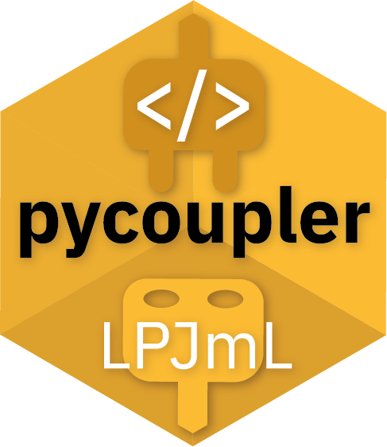

# pycoupler  <a href=''></a>

An LPJmL Python interface to operate
[LPJmL](https://github.com/PIK-LPJmL) within a Python
environment and to couple it to Python models, programs or simple programming scripts. *pycoupler* is written with the intention to establish the coupling of
[copan:core](https://github.com/pik-copan/pycopancore/) with LPJmL. Coupling with LPJmL is possible on an annual basis, i.e. for each year in which LPJmL is in coupling mode, the desired inputs must be passed via *pycoupler*. LPJmL then continues with the simulation of the corresponding year and returns the desired outputs at the end of the year. Based on the output data, the coupled program can now generate new inputs.

## Overview

### LPJmL Config &#9881; for handling LPJmL configurations
* Read LPJmL configuration files
* Set LPJmL configuration parameters
* Write LPJmL configuration files
* ...

### LPJmL Coupler &#128268; to couple LPJmL with other models
* Initiate Coupling to LPJmL
* Send input data to LPJmL
* Read output data from LPJmL
* Close coupling
* ...
### Miscellaneaous
* Run/submit LPJmL simulations
* Check LPJmL configuration files
* Supply and preprocess input data for LPJmL
* Read and postprocess LPJmL output data
* ...

## Installation

Use the package manager [pip](https://pip.pypa.io/en/stable/) to install pycoupler.

```bash
pip install .
```

Please make to clone LPJmL in advance and provide its path via `model_path`.  
Also make sure to also have set the [working environment for LPJmL](https://gitlab.pik-potsdam.de/lpjml/LPJmL_internal/-/blob/master/INSTALL) correctly if you are not working
on the PIK cluster (with Slurm Workload Manager).  


## Contributing
Merge requests are welcome. For major changes, please open an issue first to
discuss what you would like to change.

Please make sure to update tests as appropriate.
